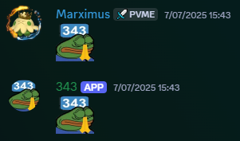
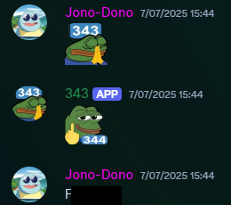

# discord-bot-replier

Detects a specific emote sent at a specific time.  
Replies with a "success" emote when the time is met.  
Replies with a "failure" emote if the time is missed by a minute.

## Example

**Success:**  


**Failure:**  


## Setup Guide

1. Create a `.env` file in the same directory as `bot.js` with the following content:

	```env
	DISCORD_TOKEN=xxxx
	TRIGGER_EMOJI=:emoji:
	RESPONSE_EMOJI=<:emoji:id>
	FAILURE_EMOJI=<:emoji:id>
	TRIGGER_HOUR=3
	TRIGGER_MINUTE=43
	```

	- The token is only generated once when creating an application. See the [Discord Developer Quick Start Guide](https://discord.com/developers/docs/quick-start/getting-started).
	- Time is in 12-hour format and applies to both AM and PM.
	- You can get the emoji ID by typing `\:emoji:` in Discord, which should print something like `<:prayge343:1098915233558450196>`.

2. Run the JS file!  
	 You can use [pm2](https://pm2.keymetrics.io/) or [Docker](https://docs.docker.com/get-started/get-docker/) to keep it running constantly.